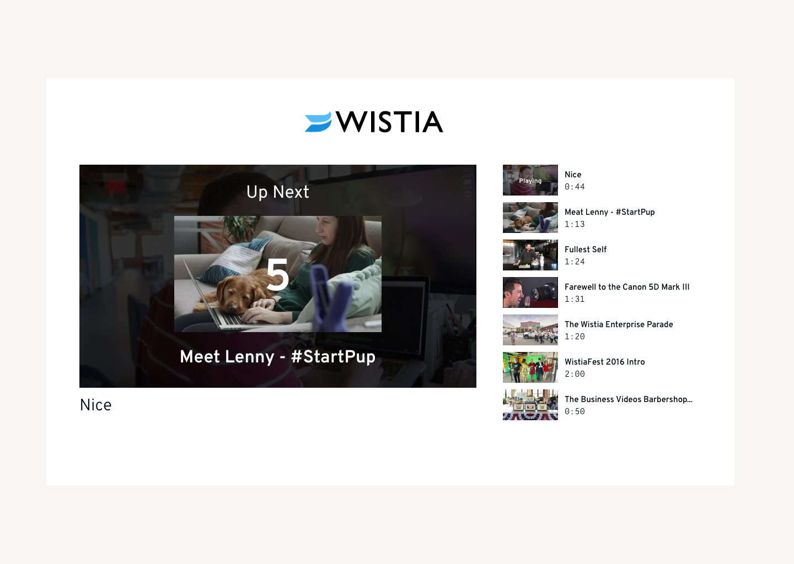

# Submission Checklist

**Please reach out if you need anything clarified or if you have any questions!**

- [x] Submission meets all sections of Feature Specifications

- [x] Code is tested in one browser of your choice

- [x] The frontend is accomplished with plain javascript, HTML, and CSS.

- [x] The backend is accomplished in Ruby, Ruby on Rails, Python, Elixir, or Node

* If you'd like to use a language that's not listed, give us a shout and we'll work with you to find a language that you know and we can evaluate.

- [x] Includes a README telling us:

* the browser and OS used

* a brief architecture overview of your design

* an explanation of the solution's performance characteristics

* anything you learned or would do differently if doing this again

* any other notes you think are relevant


## Browser and OS used in development

MacOS Monterey 12.6.3 (21G419)

Chrome Version 116.0.5845.96 (Official Build) (x86_64)


## To dive in and explore

Start the app with `node server.js` from the root directory. You'll find the playlist landing page at localhost:8000 and the dashboard page at localhost:8000/dashboard.

To test the hide/show functionality, please mark a video or two as hidden on the dashboard page and check that they are subsequently hidden from the playlist within the same server session.

Note that I've retained the initial skeleton for comparison, but my changes are largely in ./public and ./server.js


## Architectural overview

I've leveraged the existing frontend code, expanded and modified to meet the feature requirements, and our backend is a lightweight Node app using express, found mostly in ./server.js.

I opted for in-memory solutions to data persistence challenges, you'll see this discussed later in things I'd do differently.

Our api calls include fetching the project's playlist from Wistia just before server start, GETs to fetch video visibility (defaulting to true for all videos on app start) and media data for the playlist contents, and a PATCH to update a particular video's visibility boolean.

The _wq array is used to manage Wistia player instances and options.

Broadly speaking this is a naive approach, biased towards speed of delivery and intended to flesh out an MVP with a vertical slice of meaningful functionality.

## Performance characteristics

Both pages render on the order of half a second in my local environment, but I'm a little leary of all the work I've had to do in event listeners to get to this MVP. I'm sure there are performance gains to be had in both minimizing api calls and perhaps refined encapsulation of the event listener logic. Some of the DOM manipulation, especially on the playlist page is probably inefficient and/or duplicitive, I would guess.

## Things I would do if I had more time/Things I would never do in production

- A test suite! The acceptance criteria here are precise and interrelated, and while unit testing would of course be a baseline, I’d also love to have something browser driven like cypress or playwright for coverage, particularly in the context of the playlist transition behavior.

- Secure storage for the API key: some kind of secret management would be table stakes in a prod environment (yes, it’s a read-only key, but still, security is a practice)

- Fetching the medias just before server start is a fragile model for relying on an external API. Some kind of back-off retry logic or alternate approach would be necessary for a prod service.

- I believe that I was premature in my extraction of applyVisibilityClasses. The visibility checking/setting behavior on page load is not the same as clicking a single video’s visibility button, distinct logic for each would be more efficient and maintainable.

- A db: handling the relevant values in-memory did accelerate my path into working through the functional requirements, but it was ultimately shortsighted. I could have used a db console to work through the SQL/db modeling section.

- Similarly to the above, I plunged into a node implementation on the theory that this would be a relatively lightweight piece of software and it couldn’t hurt to keep my brain in JS mode throughout development. Rails might have helped me avoid some sticky bits where I was unfamiliar with express configuration, and saved me time to focus on what matters. And it would have nudged me towards a db like sqlite which would have utility elsewhere in the take-home.

- Encapsulation/separation of concerns: I found myself almost entirely working in the existing starter files (once copied into my little node app). In a production setting where we might be expanding and maintaining this code for a while I would probably extract the parallel video and visibility fetching calls to a service object, in part to keep that logic in sync and in part to make playlist.js and dashboard.js easier to read and focused on their particular interfaces

## Things I didn’t worry about

- Mobile/Cross browser. I opted not to consider mobile browsers or browsers beyond my local chrome.

- Alternate Wistia Player approaches. I didn’t try to go deep on alternate player implementations. An iframe implementation might have been more broadly supported? And structuring the playlist as an explicit sequence of media references might have been less complex to read and reason about than the event listener structure I wound up with.

- Refactoring. I didn’t spend too much time refactoring, it’s totally possible that I’ve introduced extraneous code, or failed to recognize where similar functionality could be either extracted and unified or patterned as closely as possible for a future traveler.

- Accessibility. In a production, user facing context I would dig into relevant Aria attributes and accessibility scanning/remediation.

- Linting. I’ve made some changes out of habit (I was drilled to prefer let and const to var), but without knowing the Wistia org’s standards I haven't attempted to implement a linter. My sincere apologies if this has produced awkward formatting, or if silly mistakes slipped in that a linter would have caught.

- Edgecase user behavior. It's totally possible that a user clicking around (particularly on the playlist page) might very well introduce race conditions

# Feature Specifications

## Implement autoplay for playlist

Evolve the landing page to autoplay videos as designed.

- [x] A 5-second countdown appears between videos

I can only apologize to anyone with a strong sense of frontend development and styling, I really tried to actually overlay the countdown over the player, but in the spirit of moving quickly and meeting our hard functional requirements I retreated to the implementation you see, showing the overlay countdown in the top right of the embed. This is of course something I would dig in on in a production context.

- [x] While the video is playing, the video shows as "playing" in the queue

Again, my overlay styling is... not great. I was initially applying the playing text in the renderMedia() function, which worked great for the first video, but not so much subsequent ones. I've opted to append the playing text in the play event binding and remove it in the end binding logic.

- [x] Autoplay is disabled after all videos have played once

I wound up tracking this on the fly based on a value that increments as each video plays and gates the replaceWith() logic once it's reached the count of the visible videos available. This would be brittle in the face of broad user behavior, but it seems to work satisfactorily for a demo.


- [x] Videos for autoplay are grabbed from queue's top, played videos are added to the bottom

Approached as straight up DOM manipulation as the overlay countdown ends. Inelegant (a user in the wild might very well skip the countdown), but this is an MVP.




alas, I have very much betrayed this wireframe. After spending 40 minutes trying to wrestle with styling the overlay to fit the video I surrendered and adopted the very proof of concept implementation you'll find in ./public/playlist.js. I don't think it would be unbearably difficult to style it properly or include the name and thumbnail of the next up video, I just chose to focus on meeting explicit functional requirements!


## Implement hide and show videos for the owner dashboard


- [x] Create an endpoint to manage the video's visibility

I opted for a PATCH call, modifying just the videoVisibility value. I think I would expect this to be a PUT if I encountered it in the wild, but PATCH fit my understanding of the change I was trying to make (toggling a single value on an object that would be otherwise unchanged). It works just fine in my modern Chrome browser, but I might be more cautious and do more research to confirm that the PATCH method is supported in all the relevant browsers for a production service.


- [x] Wire the endpoint to the eye toggle (strikethrough icon represents hidden)

I chose to wire my patch endpoint to the existing click event listener in dashboard.js. Adding similar icon update logic to the DOMContentLoaded event listener prompted me to extract the parallel logic to a function called by both event listeners (you could totally make the case that this was premature: only the on load version of the logic needs to update every icon, I could have implemented more targeted logic for flipping the icon of the clicked button). If I had infinite time or expected to have someone else working on show/hide logic I might very well go back and unwind that consolidation.


- [x] Update the playlist landing page to only render videos marked as visible

Though rendering only videos marked as visible in the renderMedia() function was reasonably straightforward, I struggled a bit to avoid autoplaying a hidden first video in the playlist. That is, until I realized I was treating the Wistia embed document manipulation as sacrosanct: once I considered modifying it I stumbled onto the notion of a filtered object containing only the visible videos, and could use the first video in that object to instantiate the player without fear of playing a “hidden” video.


SQL/db design modeling for Wistia take home


## Design the database for "search by tag" for the owner dashboard

*No code implementation is necessary for this part of the assignment. A written explanation is sufficient.*


Imagine a tech lead asks you to design the database for a "search by tag" feature. Users should be allowed to tag videos and find videos matching that tag.


Here's a sample `videos` schema to get you started:


```

videos

- id

- description

- created_at

- play_count

...other stuff

```


Please use SQL for your solution as opposed to an ORM.


- [x] Write a query to print the total number of videos with at least 1 play count

`COUNT * FROM videos WHERE play_count > 0`

- [x] Create the schema(s) to support tags

### Option 1:


```

videos

- id

- description

- created_at

- play_count

...other stuff

```


```

tags

- id

- name

```

```

video_tags

- id

- video_id

- tag_id

```

Arguments in favor: clean to reason about (one link table entry per tagging instance), straightforward-ish to query for the info requested below. Easy to add or modify tag metadata if that occasion arises without mucking about in the structure of the videos table

Arguments against: Going to be writing more JOINS than otherwise. There’s probably a case to be made against the overhead (an extra db table) and/or the performance implications of a link table in some database ecosystems?


### Option 2

Encode tags into a data object stored on the videos table, ie:


```
videos

- id

- description

- created_at

- play_count

- tags (typed as an array of strings or JSON or ???)

- ...other stuff

```


Arguments in favor: I’ve definitely worked on Rails models that had blobs of JSON encoded onto them, so presumably there’s some persuasive argument for it (or constraint that demands it). It does avoid the db and operational complexity of spinning up a couple new tables, but…

Arguments against: Data integrity will be a challenge, querying and aggregation will be more opaque to reason about, expansion or modification of the tag structure will be both challenging to model and necessarily involve rebuilding the videos table, introducing both risk and complexity. Essentially: probably not a great fit for a “search by tag” feature. And I’m not sure you can efficiently index either JSON encoded tags or an array of tags, which may have serious performance implications at scale


- [x] Write a query to find the video with the most number of tags. If more than one video have the same number of tags, print the one created most recently.


Presuming we go with some solution like Option 1 above, perhaps something like:

```
SELECT videos.id, videos.description, videos.created_at, videos.play_count, COUNT(tags.tag_id) AS tag_count

FROM videos

JOIN video_tags ON videos.id = video_tags.video_id

JOIN tags ON video_tags.tag_id = tags.id

GROUP BY videos.id, videos.description, videos.created_at, videos.play_count

ORDER BY tag_count DESC, videos.created_at DESC

LIMIT 1;

```

Thank you for your time and care in reviewing this take home, I really enjoyed working on it and I hope I get the opportunity to discuss it with you!